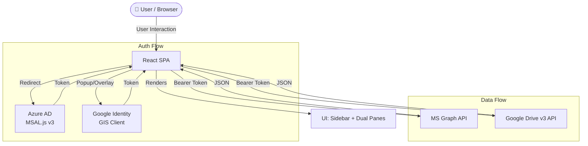

# Architecture — Multi-Cloud Explorer v1.1

## Overview

A **pure frontend** React + Vite single-page application. There is no backend server — all authentication and data fetching happens directly between the browser and cloud services (Azure for OneDrive + Google Cloud for Google Drive). This keeps hosting cost at **$0** and eliminates backend complexity.

---

## System Data Flow



---

## Component Architecture

The application is structured around a **Dual-Pane Layout** with a unified sidebar.

```
App.jsx (Root)
├── Sidebar (User Accounts & General Nav)
├── OneDrive Pane (CloudPane instance)
└── Google Drive Pane (CloudPane instance)
```

### Reusable `CloudPane` Pattern
The `CloudPane.jsx` component is an abstraction layer that handles:
- Breadcrumb navigation state.
- Folder selection (entering subfolders).
- Data fetching via cloud-specific hooks (`useDriveItems` vs `useGoogleDriveItems`).
- Authentication "Locked" state (login button within the pane).

---

## Folder Structure

```
onedrive-explorer/
├── docs/                        # Project Specifications & Design
│   ├── APPLICATION_SPEC.md
│   └── ARCHITECTURE.md
│
├── src/
│   ├── api/                     # Cloud Provider APIs
│   │   ├── graphService.js      # MS Graph API (OneDrive)
│   │   └── googleDriveService.js# Google Drive v3 API
│   │
│   ├── auth/                    # Independent Auth Layer
│   │   ├── msalConfig.js        # MSAL Config (Microsoft)
│   │   └── googleAuthService.js # GIS Config (Google)
│   │
│   ├── components/
│   │   ├── CloudPane/
│   │   │   ├── CloudPane.jsx    # Dual-purpose pane component
│   │   │   └── CloudPane.css
│   │   ├── Sidebar/
│   │   │   ├── Sidebar.jsx      # Unified Sidebar for both accounts
│   │   │   └── Sidebar.css
│   │   └── ...                  # Reusable UI (Header, FileList, FileItem)
│   │
│   ├── hooks/                   # Business Logic
│   │   ├── useDriveItems.js     # OneDrive adapter
│   │   └── useGoogleDriveItems.js # Google Drive adapter
│   │ ...
```

---

## Auth & Token Management

| Cloud | Auth Method | Token Storage |
|---|---|---|
| **OneDrive** | Microsoft MSAL (PKCE) | `sessionStorage` (Managed by MSAL.js) |
| **Google Drive** | Google Identity Services (GIS) | `sessionStorage` (Managed by React state) |

All tokens are scoped precisely to `Files.Read` (OneDrive) and `drive.readonly` (Google) for maximum user privacy.

---

## Technical Debt & Warnings

- **Dual Auth Contexts**: Currently, MSAL has its own provider. Google uses a script tag in `index.html`. This is efficient for keeping bundle size small.
- **Quota Limits**: Users with massive directories (>1000 items) may see pagination gaps — current implementation loads first 200 items.
- **Cross-Cloud Transfer**: While the UI shows them side-by-side, direct file transfer between panes is not yet implemented (planned for v1.2).
